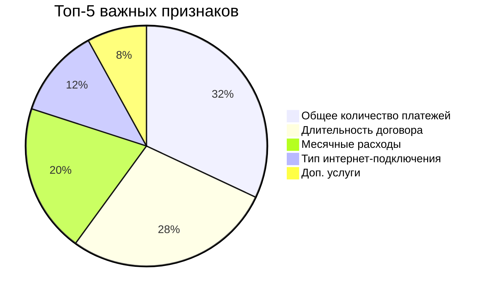

# Прогнозирование оттока клиентов для телекоммуникационной компании

## 📌 Цель проекта
Разработка модели для предсказания оттока клиентов с целевой метрикой **ROC-AUC ≥ 0.85**

----

## 📊 Данные
**Источники:**
- `contract` - информация о договорах
- `personal` - персональные данные
- `internet` - интернет-услуги
- `phone` - телефонные услуги

**Ключевые признаки:**
- Длительность договора (новый признак)
- Общее количество платежей
- Месячные расходы
- Тип интернет-подключения
- Демографические данные

----

## 🏆 Лучшая модель
```python
from catboost import CatBoostClassifier

best_model = CatBoostClassifier(
    depth=2,
    iterations=1700,
    learning_rate=0.4,
    silent=True
)
```
### Результаты:

| Метрика	| Значение |
|---------|-----------|
| ROC-AUC	| 0.97 |
| Accuracy	| 0.94 |
| Recall (класс 1) |	0.87 |
| Precision (класс 0) |	0.96 |

### 🔍 Важность признаков

----

## 💡 Бизнес-рекомендации
Для клиентов с 2-летним договором:
 - Пересмотр ценовой политики
 - Персональные бонусы при продлении

Для пенсионеров и семей:
 - Специальные тарифные пакеты
 - Дополнительные сервисы в подарок

Для пользователей доп. услуг:
 - Контроль качества сервисов
 - Программы лояльности
