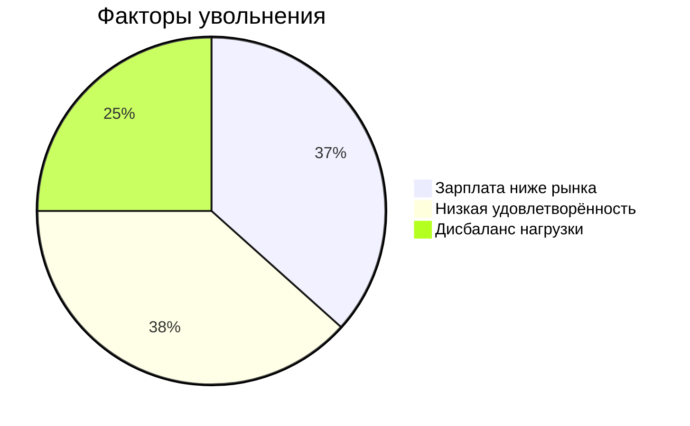

# HR-аналитика: Прогнозирование удовлетворённости и текучести кадров  

---

### 🔍 Цели исследования  
1. Построить модель прогнозирования уровня удовлетворённости сотрудников  
2. Разработать алгоритм предсказания увольнений  
3. Выявить ключевые факторы текучести кадров  

---

### 📊 Данные  
**Использованные данные:**  
- 5 файлов с показателями по 1,247 сотрудникам  
- Период наблюдения: 2022-2023 гг.  

---

## 🔍 Ключевые результаты

### 📊 Прогнозирование удовлетворённости
| Метрика | Значение | Целевой показатель |
|---------|----------|-------------------|
| SMAPE | 13.64% | <15% |
| Топ-факторы | Зарплата (0.38), Стаж (0.29), Проекты (0.21) | - |

### ⚠️ Прогнозирование увольнений
| Метрика | Значение | Целевой показатель |
|---------|----------|-------------------|
| ROC-AUC | 0.915 | >0.91 |
| Группы риска | 1 год работы (62%), Джуниоры (58%), ЗП ниже среднего (67%) | - |

### 📉 Факторы увольнений

### 🏆 Лучшие модели
| Задача |	Модель	| Параметры |
|---------|----------|-------------------|
| Удовлетворённость | DecisionTreeRegressor	| min_samples_split=14, max_features=13 |
| Увольнения |	DecisionTreeClassifier |	max_features=9, max_depth=7 |

## 💡 Рекомендации для HR

Система адаптации:

 - Ввести программу наставничества для новичков (1-3 года)

 - Регулярные check-in встречи

Программы удержания:

 - Пересмотр компенсационной политики

 - Гибкие бонусные схемы

Мониторинг:

 - Ежеквартальные опросы удовлетворённости

 - Дашборд рисков увольнения
